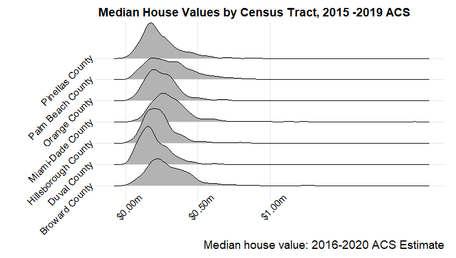

# R_Visualizing_Home_Values

**Using R for Home Value Visualisation**

This code uses the [TidyCensus](https://www.rdocumentation.org/packages/tidycensus/versions/1.1 "Tidycensus") Package to create simple visualisation which allows for easy comparison for similar geographies from US Census.

Data were pulled from the using the Census API with the tidycensus package.

1.  Plot of the trend of median housing value across Miami-Dade country was made (2005 - 2019)

1.  Trend plot with error margin for the same county

Another data pull was carried out to get data across different counties at the tract level for median house values for the AC5 datasets i.e. median house value 2020.

And finally different plots at the county level were made for comparison of the median house values across the counties.

The code was adapted from <http://geospatialtraining.com/visualizing-home-values-in-texas-with-r/>
